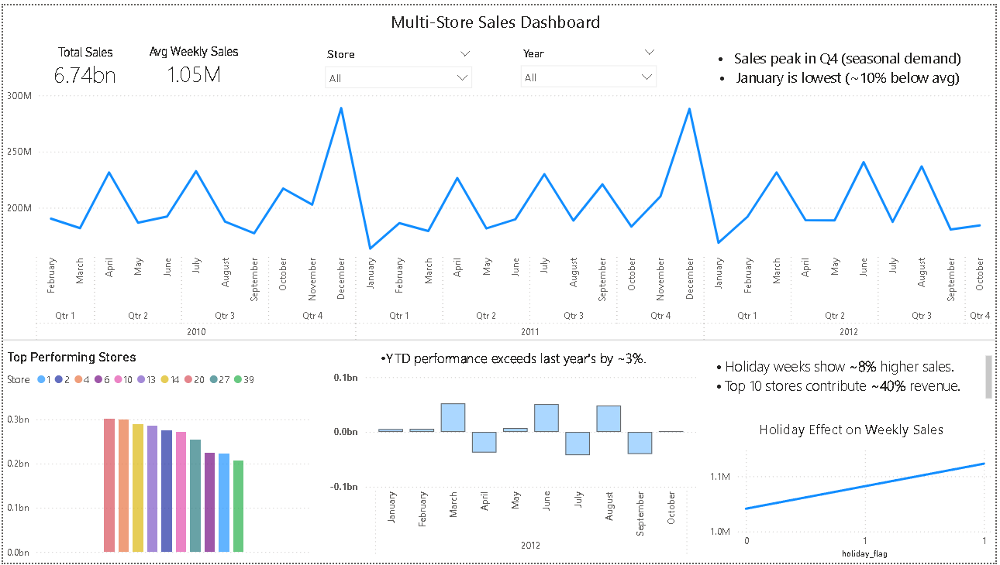

# Dashboard Preview 
 

# Multi-Store-Sales-Dashboard-and-forecasting-model
This project analyzes multi-store sales performance using SQL, Python, and Power BI to identify seasonal demand patterns, cyclical sales behavior, top-performing stores, and forecasting trends across different business periods.

# Key Business Insights
• Sales consistently peaked during Q4 holiday periods.
• January sales remained ~10% below yearly average.
• Top 10 stores contributed nearly ~40% of total revenue.
• Holiday weeks showed ~8% higher average sales.

# Analytical Workflow
• Performed duplicate and null-value validation using SQL.
• Conducted monthly and yearly sales aggregation analysis.
• Identified seasonal sales peaks and cyclical demand fluctuations.
• Applied Python-based forecasting and trend analysis techniques.
• Built an interactive Power BI dashboard for store-level performance monitoring.

